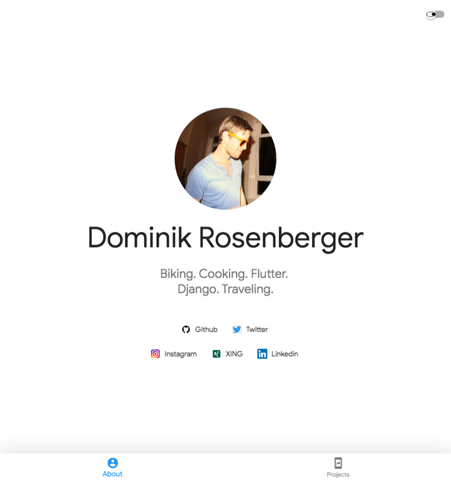

# Simple Flutter Web App

A simple Flutter Web App showing a 2-tab bottom menu and a switch button to change the theme style.

A live example can be found at [dominik-rosenberger.com](https://www.dominik-rosenberger.com "Dominik Rosenberger's Homepage")

## Screenshot

